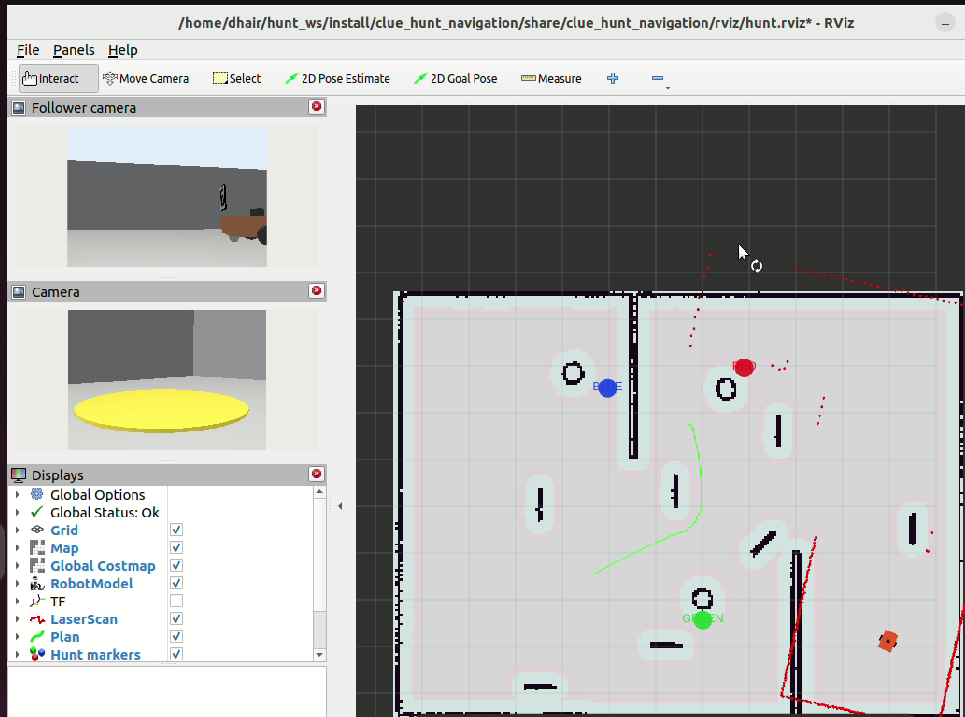

# Autonomous Leader-Follower Clue Chain Hunt

ROS 2 Humble solution for the Clue Chain Hunt hardware bootcamp challenge. The leader authenticates visual clues, estimates targets in the map frame and navigates with Nav2. The follower tracks the leader's rear fiducial using only its own camera and wheel odometry.



## Submission package

- [`clue_hunt_solver/`](clue_hunt_solver/) - ROS 2 package, nodes, launch files, configuration, tests and saved map.
- [`docs/Clue_Chain_Hunt_Technical_Report.pdf`](docs/Clue_Chain_Hunt_Technical_Report.pdf) - five-page technical report.
- [`docs/screenshots/`](docs/screenshots/) - original map, hunt, follower and failure evidence.

The repository deliberately excludes `build/`, `install/`, `log/`, VM files, credentials and modified organizer packages.

## Implemented capabilities

- DICT_4X4_50 ArUco detection and calibrated pose estimation.
- QR decoding through ZBar with OpenCV/perspective fallbacks.
- SHA-1 clue-chain authentication and decoy/look-alike rejection.
- `GOTO`, `PILLAR`, `BETWEEN`, `REL` and `TREASURE REL` target resolution.
- TF2 conversion of board and pillar observations into `map`.
- Nav2 goals, map-derived exploration, local orbit search and goal timeout recovery.
- Camera/odometry-only follower trail with a 1.15 m target and 0.75 m hard stop.
- RViz markers for boards, pillars and treasure, plus follower range/path diagnostics.

## Environment

- Ubuntu 22.04
- ROS 2 Humble
- Gazebo Fortress and Nav2 from the organizer workspace
- Python 3, OpenCV, NumPy, ZBar/pyzbar

## Workspace setup

Place the organizer repository and this repository under the same ROS workspace `src` directory:

```bash
mkdir -p ~/hunt_ws/src
cd ~/hunt_ws/src
git clone https://github.com/Club-Handler/Clue_Chain_Hunt_Bootcamp.git
git clone https://github.com/Dhairy006/clue-chain-hunt.git

cd ~/hunt_ws
source /opt/ros/humble/setup.bash
sudo apt update
sudo apt install -y python3-pyzbar libzbar0
rosdep install --from-paths src --ignore-src -r -y
colcon build --symlink-install
source install/setup.bash
```

If another copy of `clue_hunt_solver` exists anywhere under `~/hunt_ws/src`, remove or move that duplicate before running `rosdep` or `colcon`.

## Run

For an evaluator-managed simulator and Nav2 stack:

```bash
source /opt/ros/humble/setup.bash
source ~/hunt_ws/install/setup.bash
ros2 launch clue_hunt_solver hunt.launch.py
```

For the local practice world, saved map, Nav2, RViz and both custom nodes:

```bash
source /opt/ros/humble/setup.bash
source ~/hunt_ws/install/setup.bash
LIBGL_ALWAYS_SOFTWARE=1 ros2 launch clue_hunt_solver autonomy.launch.py \
  gui:=false rviz:=true
```

`autonomy.launch.py` defaults to the packaged `maps/arena.yaml`; override it with `map:=/absolute/path/to/map.yaml` if required.

## Required and diagnostic topics

| Topic | Type | Purpose |
|---|---|---|
| `/hunt/clues` | `std_msgs/String` | Accepted QR payloads in chain order |
| `/hunt/boards` | `std_msgs/String` | Accepted board ID and estimated map position |
| `/hunt/treasure` | `geometry_msgs/PoseStamped` | Final treasure pose, published once |
| `/follower/cmd_vel` | `geometry_msgs/Twist` | Follower velocity command |
| `/leader/status` | `std_msgs/String` | Leader state diagnostics only |
| `/hunt/markers` | `visualization_msgs/MarkerArray` | Boards, pillars and treasure in RViz |
| `/follower/range` | `std_msgs/Float32` | Measured tag range in metres |
| `/follower/path` | `nav_msgs/Path` | Follower trail in `follower/odom` |

The follower does **not** subscribe to `/leader/status` or any leader/Gazebo localization data. It behaves safely if all leader topics are absent.

## Tests

The offline clue and image-fixture tests do not require a running ROS graph:

```bash
cd ~/hunt_ws/src/clue-chain-hunt/clue_hunt_solver
python3 -m unittest discover -s test -v
```

Expected result: 5 tests pass. For live acceptance, monitor:

```bash
ros2 topic echo /hunt/clues
ros2 topic echo /hunt/boards
ros2 topic echo /hunt/treasure
ros2 topic echo /follower/range
```

## Validation status

Offline clue, decoy and supplied-texture tests pass. Integrated screenshots demonstrate mapping, camera rendering, marker visualization, follower observation and Nav2 planning. A final submission still needs one uninterrupted recorded run through the full chain, including the follower, with measured completion time and range extrema. The report labels this honestly as **evidence pending** until that run is recorded.

## VirtualBox note

If Gazebo cameras render blank or the VM freezes, select VMSVGA, allocate 128 MB video memory, disable 3-D acceleration and launch with `LIBGL_ALWAYS_SOFTWARE=1`. `glxinfo -B` should report `llvmpipe` in this configuration.
